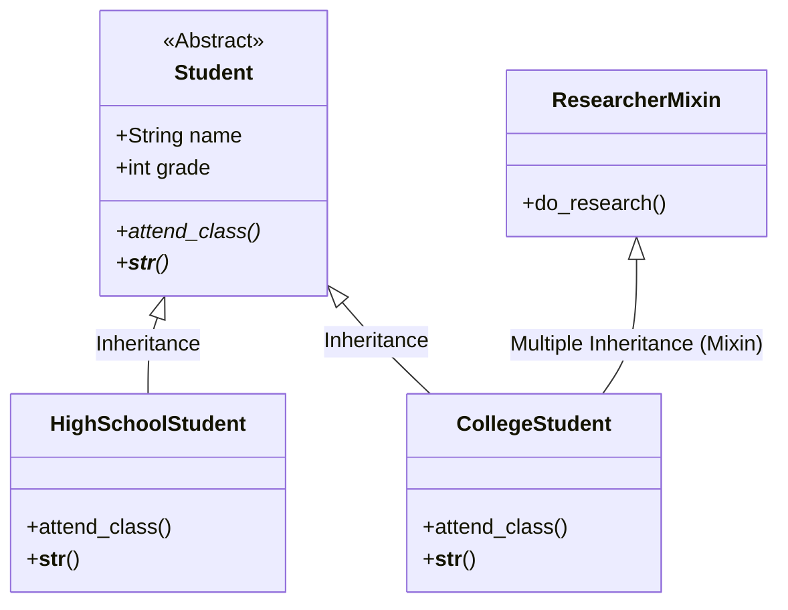

```mermaid
classDiagram
class Student {
<<Abstract>>
+String name
+int grade
+attend_class()*
+__str__()*
}
class ResearcherMixin {
+do_research()
}
class HighSchoolStudent {
+attend_class()
+__str__()
}
class CollegeStudent {
+attend_class()
+__str__()
}
Student <|-- HighSchoolStudent : Inheritance
Student <|-- CollegeStudent : Inheritance
ResearcherMixin <|-- CollegeStudent : Multiple Inheritance (Mixin)
```